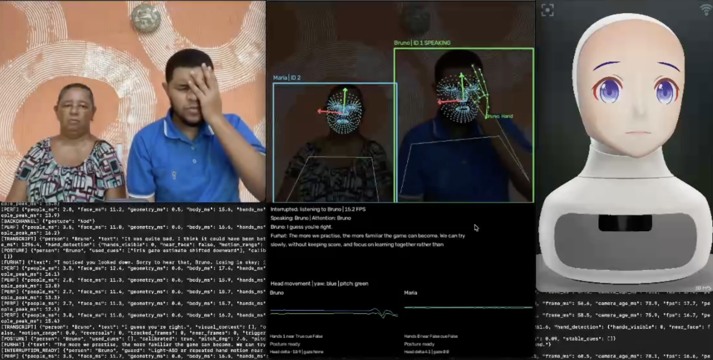

<div align="center">

# Real-Time Multimodal Interaction with Furhat

**See · Listen · Understand · Respond**

A lightweight Python toolkit for natural, multimodal interaction with individuals and groups.


[](LICENSE)


[🚀 Setup](#setup) · [▶️ Run](#run) · [🧠 Models](#models) · [✨ Capabilities](#capabilities) · [🛠️ Architecture](docs/architecture.md)

</div>



*Recorded interaction on an 8 GB MacBook Air: clean camera view on the left, tracked participants and visual cues in the middle, Virtual Furhat on the right.*

<a id="capabilities"></a>

## ✨ What it does

| Capability | Behavior |
|---|---|
| 👀 Visual attention | Detect participants, follow them and direct the robot toward the person being addressed. |
| 🎙️ Active-speaker detection | Combine audio and face video to associate a spoken turn with a tracked participant. |
| 💬 Conversation | Transcribe speech locally and give the language model speech, names and observed visual context. |
| 🥤 Object awareness | Recognize objects and acknowledge the object a newcomer brings into the interaction. |
| ✋ Gestures and games | Detect hand signs, associate hands with participants and score three rock–paper–scissors rounds. |
| 🙂 Responsive behavior | Use head movement, approximate gaze and hand cues; nod while listening and handle experimental interruptions during conversation. |
| 🤖 Embodied responses | Use Furhat's native voice, lip synchronization, head movement and facial gestures. |

**One ongoing interaction.** Start the app, introduce yourself and talk naturally. Furhat receives speech together with observed objects, posture, gaze and gestures. Ask to play a game and it switches into game mode; after scoring three rounds, it invites reflection and returns to conversation. Names and game results stay in session memory—no scenario or winner command is needed.

The continuous app is a **new integration awaiting live validation**. Its individual demonstration components have been recorded successfully. The current release supports individual interaction and a two-participant group; **larger groups are coming soon**. Speech is currently turn based, with experimental interruption handling; simultaneous speech separation and fully conversational full-duplex operation are planned.

<a id="setup"></a>

## 🚀 Get started

### 1 · Prepare the robot and local language model

- Install **Python 3.12**, the **Furhat SDK** and **[Ollama](https://ollama.com/)**.
- Start Virtual Furhat and enable its **Realtime API**.
- Select a working voice in the SDK and verify speech and lip synchronization there.
- Download the local language model:

```bash
ollama pull llama3.2:1b
```

If Ollama is not already running, keep `ollama serve` running in a separate terminal.

### 2 · Clone and install

```bash
git clone https://github.com/BrunoMelicio/real-time-multimodal-furhat.git
cd real-time-multimodal-furhat
python3.12 -m venv .venv
.venv/bin/python -m pip install -r requirements.txt
```

Use this **one environment** for the app and all demos. You do not need to activate it: the commands explicitly select its Python executable.

### 3 · Get the perception models

```bash
.venv/bin/python tools/setup_models.py --download
```

This downloads the selected small perception checkpoints and verifies their hashes against [the model manifest](models/manifest.json). Weights are kept locally and excluded from Git. Whisper.cpp may download `base.en` to its own cache on first use.

Already have the perception weights? Copy and verify them instead:

```bash
.venv/bin/python tools/setup_models.py --from-directory /path/to/existing/models
```

### 4 · Check the installation

```bash
.venv/bin/python main.py --check
```

This checks dependencies and perception model files. It does **not** open devices, load models or test connections to Furhat/Ollama.

> **Existing development checkout:** use `../.venv/bin/python` instead of `.venv/bin/python` when the environment is in the parent directory. Keep the existing environment rather than creating another copy.

<a id="run"></a>

## ▶️ Run an interaction

### Individual interaction

```bash
.venv/bin/python main.py --people=1 --mic=builtin
```

### Group interaction

```bash
.venv/bin/python main.py --people=2 --mic=builtin
```

### Larger groups · coming soon 🚧

Support for more than two participants is on the roadmap. For now, `--people` accepts `1` or `2` and sets participant capacity.

**Arrange the windows, then press Space** in the preview to start. **Q / Esc** closes the app. You can begin a group session with one participant; a newcomer is introduced when they join.

Names are normally collected through conversation. Optionally supply them in **left-to-right preview order**:

```bash
.venv/bin/python main.py --people=2 --mic=iphone --names Alice Bob --profile
```

| Option | Use |
|---|---|
| `--people=1` / `--people=2` | Configure individual or group interaction. |
| `--names Alice Bob` | Optional participant names; all named participants must be visible before Space. |
| `--mic=builtin` / `--mic=iphone` | Select a microphone by name; numeric device IDs can change. |
| `--camera=0` | Select the camera. |
| `--host=127.0.0.1` | Connect to local Virtual Furhat; change for another host. |
| `--whisper=base.en` / `--whisper=small.en` | Prefer Base for speed; try Small for accuracy. |
| `--object-model=ssd` / `lite0` / `lite2` | Change the object detector. |
| `--model=llama3.2:1b` | Select an installed Ollama model; `gemma3:270m` is a smaller fallback. |
| `--profile` | Print frame-stage timings every three seconds. |

### 🎮 What interaction can look like

- **Welcome:** Furhat notices a participant, asks their name and keeps it for the session. A newcomer is welcomed after the current spoken turn.
- **Object-aware conversation:** hold a bottle/cup clearly in view; ask about it or let the detected object inform the reply.
- **Play:** ask naturally to play. The LLM selects the game transition—there is no exact trigger phrase. Furhat plays against an individual or judges a game between participants.
- **Gesture answers:** answer the rules question with speech, a nod or a head shake. Show a fist, palm or V sign for rock, paper or scissors.
- **Reflect:** game results automatically become conversation context. Furhat asks how the game felt and can acknowledge observed downward posture or facial movement.
- **Interrupt:** experimental speech/near-face-motion handling can stop a robot reply and continue with the participant's new turn. Visual cues are uncertain; safely mime near-face movement without contact if demonstrating it.

The app loads the selected perception components once and keeps them active. It saves no recordings or run files. Small standalone demonstrations remain under `demos/` for component checks.

<a id="models"></a>

## 🧠 Models and hardware

| Component | Selected implementation | Role |
|---|---|---|
| Person detection/tracking | [YOLO26 Nano](https://github.com/ultralytics/ultralytics) | Maintain participant boxes and short-lived track IDs. |
| Face/head/gaze | [MediaPipe Face Landmarker](https://github.com/google-ai-edge/mediapipe) + geometry | Estimate head orientation and relative iris displacement. |
| Body | [MediaPipe Pose Landmarker Lite](https://github.com/google-ai-edge/mediapipe) | Body landmarks and wrist evidence for hand ownership. |
| Hands | [MediaPipe Gesture Recognizer / Hand Landmarker](https://github.com/google-ai-edge/mediapipe) | Game signs and hand movement near the face. |
| Objects | [SSD MobileNetV2](https://github.com/tensorflow/models/tree/master/research/object_detection) or [EfficientDet-Lite0/Lite2](https://github.com/google/automl/tree/master/efficientdet) | Lightweight object recognition; the continuous app defaults to Lite0. |
| Speech activity | [Silero VAD](https://github.com/snakers4/silero-vad) | Detect speech boundaries and support interruptions. |
| Active speaker | [Light-ASD](https://github.com/Junhua-Liao/Light-ASD), approximately 1.02M parameters | Match audio activity to visible face video. |
| Transcription | [Whisper](https://github.com/openai/whisper) `base.en` via [whisper.cpp](https://github.com/ggml-org/whisper.cpp) / [pywhispercpp](https://github.com/absadiki/pywhispercpp) | Local ASR; `small.en` is optional. |
| Language | [Ollama](https://github.com/ollama/ollama) / [Llama 3.2 1B](https://github.com/meta-llama/llama-models) | Context-aware responses; Gemma 270M is the smaller fallback. |
| Voice/lip sync | [Furhat native speech](https://docs.furhat.io/realtime-api/events) | Retain the SDK's synchronized facial animation. |

**Development hardware:** MacBook Air **M3, 8 GB unified memory**, webcam, built-in or iPhone microphone, and **Virtual Furhat SDK 2.9.3**. OBS was used to record demonstrations; it is not required to run them.

The continuous app runs MediaPipe, YOLO, Light-ASD and the default Whisper backend on **CPU**. Ollama manages its own acceleration. These are selected runtime choices, not a guarantee that GPU execution is faster. The smaller fallback is [Gemma 3 270M](https://github.com/google/gemma_pytorch). **Built with Llama** when using the default language model.

### 📊 Validation and practical limits

- The separate individual and group demonstrations were run and recorded by the project author.
- A recent two-person reflection log on the M3 showed approximately **13–18 FPS** with the required perception stack active. This is a historical standalone-demo run, not a measurement of the new continuous app or a guaranteed rate.
- Offline regression tests check scene transitions, gesture policies, speaker ownership, cue handling and shutdown with synthetic data/mocks.
- Fresh-machine installation of the pinned dependencies still needs validation. MediaPipe and Ultralytics request different OpenCV distributions; avoid uninstalling either from a working environment in place.

Tracking is spatial, **not biometric identity**. Iris-based gaze is approximate. Observable posture/hand movement does not establish emotions, injury or clinical effectiveness. The continuous individual game commits random robot moves before reading hand signs; the group referee scores detected signs.

## 🧪 Run the tests

```bash
.venv/bin/python -m unittest discover -s tests -v
```

Tests do not open a camera/microphone, start the robot or run model inference. Environments, model weights, recordings, participant transcripts and local rollback notes are excluded from Git.

## 📚 Learn more

- [🛠️ Architecture and execution flow](docs/architecture.md)
- [📜 Third-party source, models and licenses](docs/third_party.md)

## 📜 License

The project's **original source code is licensed under [MIT](LICENSE)**, allowing use, modification and redistribution under its terms.

**Check the license of every dependency and model checkpoint before use, redistribution or deployment.** The MIT license here does not relicense third-party code, weights or SDK services. In particular, [Ultralytics YOLO uses AGPL-3.0 or an Enterprise license](https://www.ultralytics.com/license), and [Llama 3.2 has its own Community License and use policy](https://github.com/meta-llama/llama-models/blob/main/models/llama3_2/LICENSE). Their obligations can apply to a combined application; this repository's MIT label does not remove them.

## ✅ To do

- [ ] Support groups with **more than two participants**.
- [ ] Create a **Hugging Face Spaces demo**.
- [ ] Integrate with **other robots** through replaceable robot adapters.
- [ ] Add **full-duplex, non-turn-based conversation**, with continuous listening, natural interruptions and overlapping speech handling.
- [ ] Validate the continuous app on additional hardware and expand end-to-end tests.
