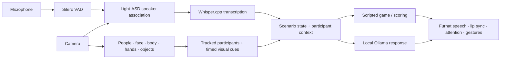

# 🛠️ How the interaction works

## ⚙️ Runtime design

- **One scenario per process:** `main.py` routes to introduction, game or reflection for one or two people. It imports the selected runtime after parsing arguments.
- **Shared paths:** `furhat_interaction/paths.py` anchors models and outputs to the repository, independent of module location.
- **Fresh camera frames:** a latest-frame capture avoids building a queue of stale video frames.
- **Separate ownership:** the two-person runtime separates audio analysis, transcription and dialogue work from the preview loop.
- **Speaker attribution during speech:** the participant is associated using evidence collected while the utterance occurs, rather than whichever box is active when transcription finishes.
- **Hand ownership:** body wrists and spatial evidence associate hands with participants; ambiguous assignments are rejected.
- **Continuous perception within a scene:** all visual components required by that scenario remain active. Introduction uses objects; game/reflection use body and hands.
- **Native output:** Furhat produces speech and lip synchronization. Python sends attention and gesture commands.

## 🧩 Where to look

| Folder/module | Responsibility |
|---|---|
| `furhat_interaction/app.py` | Routing and dependency preflight |
| `single_person/` | One-person scenario entrypoints |
| `multi_person/` | Two-person state, audio, cues, perception and timing |
| `dialogue.py`, `asr.py`, `active_speaker.py`, `audio/` | Conversation, recognition, speaker detection and VAD |
| `vision.py`, `head_gaze.py`, `game_vision.py`, `reflection_vision.py` | Camera, geometry and perception |
| `game.py`, `reflection.py`, `group/` | Game policies, reflection cues, robot and ownership helpers |
| `third_party/light/` | Vendored Light-ASD model architecture and MIT license |

## 📊 Timing

For two-person scenes, `--profile` reports mean stage durations and recent FPS. It separates people, face, geometry, body, hands, rendering and display work. ASR logs report decoding and final-after-voice latency. FPS alone does not describe conversational response delay.

The current two-person runs keep terminal logs and do not save run files. Single-person scenes retain their local session/output behavior under ignored `text_output/single_person/` folders. Model weights stay under ignored `models/` paths; Whisper uses its own cache.

## 🔜 Next milestone

A continuous session should load the selected stack once and carry names/game results through all three scenarios in memory. That integration is **not implemented by the current scene launcher**. Validate it incrementally, starting with one participant. Overlapping speech separation is also outside the current scenarios.

[← Back to the README](../README.md)
