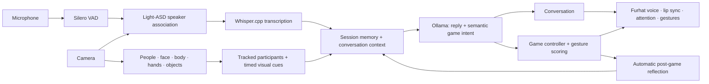

# 🛠️ Continuous multimodal interaction

## ⚙️ How the app runs

1. **Load once:** `main.py` starts one session with shared camera, perception, audio, transcription and dialogue owners. Required models are reused across conversation, games and reflection.
2. **Observe continuously:** people, faces, approximate gaze, body pose, hands and objects remain active. Participant capacity currently accepts one or two; larger groups are planned.
3. **Associate speech:** VAD finds speech boundaries. Light-ASD associates the utterance with a tracked participant using evidence from **during speech**, before transcription finishes.
4. **Build context:** send the local language model the named participant's speech, recent conversation, observed visual cues, object association and actual game results.
5. **Choose an action:** the LLM returns a validated reply/action. A semantic game request enters rock–paper–scissors without an exact trigger phrase. Python controls rounds and scoring.
6. **Reflect and continue:** keep results in memory, ask about the game and return to ongoing conversation. No external winner argument or separate reflection launch is needed.

The new continuous integration has offline state/routing tests; **live end-to-end validation is still pending**. Standalone component demonstrations remain available independently.

## 🧠 Upstream components

| Component | Official source | Use here |
|---|---|---|
| People/tracks | [Ultralytics YOLO](https://github.com/ultralytics/ultralytics) | Nano person detector and short-term tracking |
| Face, body and hands | [MediaPipe](https://github.com/google-ai-edge/mediapipe) | Landmarks, gesture labels and calibrated relative cues |
| Objects | [TensorFlow Object Detection](https://github.com/tensorflow/models/tree/master/research/object_detection), [EfficientDet](https://github.com/google/automl/tree/master/efficientdet) | SSD / EfficientDet-Lite via MediaPipe |
| Voice activity | [Silero VAD](https://github.com/snakers4/silero-vad) | Speech segmentation and interruption evidence |
| Active speaker | [Light-ASD](https://github.com/Junhua-Liao/Light-ASD) | Match speech activity with visible face video |
| ASR | [Whisper](https://github.com/openai/whisper), [whisper.cpp](https://github.com/ggml-org/whisper.cpp), [pywhispercpp](https://github.com/absadiki/pywhispercpp) | Local Base/Small transcription |
| Language | [Llama](https://github.com/meta-llama/llama-models) via [Ollama](https://github.com/ollama/ollama) | Conversation and semantic game decisions; Built with Llama by default |
| Smaller language fallback | [Gemma](https://github.com/google/gemma_pytorch) | Optional locally installed 270M model |
| Robot interface | [Furhat Realtime API](https://docs.furhat.io/realtime-api/intro) | Native speech, lip sync, head attention and facial gestures |

## ⏱️ Responsiveness and ownership

- A latest-frame camera avoids stale video queues.
- Audio analysis and transcription run separately from the preview; small queues limit backlogs.
- Uncertain speaker attribution asks for a repeat instead of assigning a transcript to the wrong participant.
- Hand ownership uses body wrists and spatial evidence; ambiguous assignments are rejected.
- One-person robot moves are randomly committed before reading the person's hand. Group scores come from observed signs.
- A listening nod is throttled; head-follow commands briefly pause so the acknowledgment stays visible.
- Conversation memory and visible dialogue are bounded. No recordings or run reports are saved by the continuous app.
- `--profile` reports perception/render/display timings. ASR logs report decode and final-after-voice delays; FPS alone does not describe conversational latency.

Current conversation remains turn based. Experimental VAD/Light-ASD interruptions can stop a robot reply; there is no acoustic echo cancellation or integrated overlapping-speech separation. Full-duplex conversation is on the roadmap.

## 📜 Licensing

Original project code uses [MIT](../LICENSE). **Dependencies and model weights retain their own licenses**; check them before deploying or distributing a combined system. See [third-party notices](third_party.md), particularly YOLO's AGPL/Enterprise terms and Llama's Community License.

[← Back to the README](../README.md)
